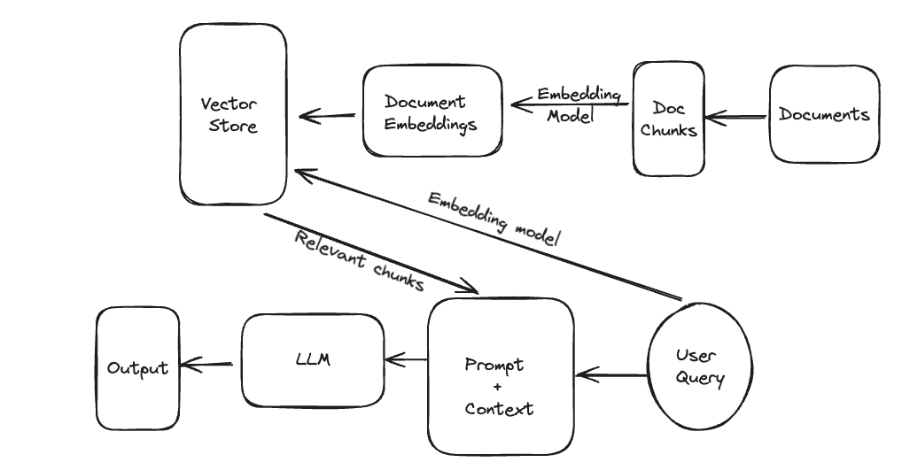
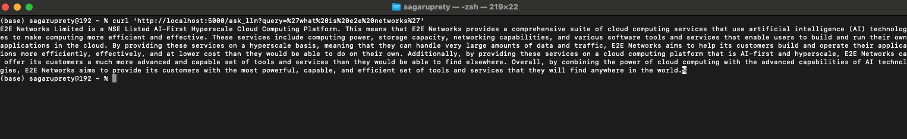

# Step-by-Step Guide for SaaS Entrepreneurs to Leverage RAG AI Pipeline

In this article, we want to showcase how SaaS platform entrepreneurs and SaaS startups can leverage the RAG pipeline using fully open-source technologies.

## Introduction

SaaS platforms will increasingly have an AI component, and leveraging AI technologies can provide significant advantages in terms of efficiency, personalization, and scalability. Large Language Models (LLMs) offer a powerful solution for enhancing natural language processing tasks in SaaS applications. Enterprises the world over are already leveraging LLMs to make sense of their vast trove of private text data - be it logs, documentation, reports, etc. In this tutorial, we consider one such use case - automating the creation of a question-answering application over company documentation for a software product or service. Within the domain of LLMs, the technique of Retrieval Augmented Generation (RAG) is best placed to build such an application efficiently and effectively. Specifically, we use the documentation of [E2E Networks](https://www.e2enetworks.com/), which is an AI-first hyperscale Cloud Computing Platform based out of India. 
While the tutorial proceeds as a notebook, you need to run the code in a .py file as it also contains a Flask app. The notebooks and Python files can be accessed at https://github.com/sagaruprety/rag_for_saas/. 
## What is RAG

LLMs are general-purpose text generation and completion models that have been trained on a very large corpus of publicly available data like books, Wikipedia, blogs, news, etc. However, it's very computationally expensive and time-consuming to train the models again on new data, which means that these LLMs are not updated with the latest information generated in society. Also, there is always some kind of privately held data upon which these models have not been trained and would not perform as well in those contexts. 
RAG is an architecture that provides a fast and cost-effective way to address some of these limitations. It enhances the capabilities of large language models by incorporating contextually relevant information retrieved from a knowledge base, usually a collection of documents.

## Problem Statement and Solution

### Problem:
Privately held data such as enterprise datasets, proprietary documents, or documents that are constantly updated pose a challenge to the effective general use of LLMs. Using LLMs to answer questions about such data will lead to hallucinations - grammatically correct but factually and contextually incorrect responses.
A trivial solution would be to connect all such data to an LLM, however, that also doesn't work because of the small context window of LLMs and the per-token (word) cost of using LLMs. E.g. an LLM cannot ingest a 100-page document to answer questions based on it. It is simply too big to input. 

### Solution: RAG
This is where the RAG architecture becomes essential. We need to not only connect all the relevant data sources to the LLM but also provide targeted chunks of the document as input to the LLM. These chunks should be big enough to encompass all the needed information and, at the same time small enough to fit into the input context window of an LLM. RAG achieves this by introducing a document retrieval step before data is fed into an LLM. The document retrieval component takes in the user's input query and retrieves only the most similar document chunks. Even before that, documents are divided into (generally) fixed-sized chunks, converted from text to numerical vectors, and indexed into a vector database.

### The RAG Architecture
The RAG architecture thus consists of the following components:
- **Document Chunking:** As the document base could be very large, each document is divided into fixed-size chunks.
- **Embedding Generation:** Each chunk is separately vectorized using an embedding model.
- **Vector Store:** The document chunks are indexed in a vector space, along with any metadata.
 - **Retrieval:** Chunks that are closest in the vector space to the embedding of the user input query are retrieved.
- **Prompting an LLM:** The retrieved chunks form the context for an LLM to answer the user query.
  



### Prerequisites
For this task, we consider the [Mistral-7B](https://mistral.ai/news/announcing-mistral-7b/) model, which is a relatively recent large language model that is open-source and developed by [Mistral AI](https://mistral.ai/), a french startup, which has gained attention because of it outperforming the popular Llama2 models. You can either use this model on a cloud environment or with some processing make it run on your laptop if it has good enough memory. It can run smoothly on Apple Silicon Macbooks (M1, M2, and M3), provided they have at least 16GB of memory. The trick to make it run with lower memory is using a method called quantization, which essentially trims down model weights from 32-bit precision to up to 4 bits of precision. More about quantization here.

One can download a quantized version of the Mistral model from Hugging Face. In this link, go to Files and Versions and select a model to download. I recommend downloading the mistral-7b-instruct-v0.2.Q4_K_M.gguf model as it is optimized both for speed and accuracy. To run the GGUF files you would need the llama-cpp-python client. This is also integrated within Langchain, so all you need to do is load the model via Langchain.

All the required libraries are listed here, install them either in a jupyter notebook or in a virtual environment.

```
!
pip install -q -U transformers langchain llama-cpp-python qdrant-client
!pip install -q -U sentence-transformers accelerate unstructured beautifulsoup4

```
#### Import libraries
```python
import os
import re
import torch
from pprint import pprint
from operator import itemgetter
from bs4 import BeautifulSoup as Soup
from collections import Counter
from transformers import BitsAndBytesConfig
from transformers import AutoModelForCausalLM, AutoTokenizer, pipeline
from langchain_community.llms.huggingface_pipeline import HuggingFacePipeline
from langchain_community.document_loaders.recursive_url_loader import RecursiveUrlLoader
from langchain.text_splitter import RecursiveCharacterTextSplitter
from langchain.vectorstores import Qdrant
from langchain.docstore.document import Document
from langchain_core.output_parsers import StrOutputParser
from langchain_core.runnables import RunnablePassthrough, RunnableParallel
from langchain_core.prompts import ChatPromptTemplate, PromptTemplate
from langchain.embeddings import HuggingFaceEmbeddings

```
#### Data Ingestion
We scrap the documentation of E2E Networks using BeautifulSoup and Langchain's recursive URL loader.
```python
url = "https://docs.e2enetworks.com/"
loader = RecursiveUrlLoader(
    url=url, max_depth=2, extractor=lambda x: Soup(x, "html.parser").text
)
docs = loader.load()
docs[0]

```
Document(page_content='\n\n\n\n\n\n\n\n\n\nE2E Networks Documentation | E2E Networks  documentation\n\n\n\n\n\n\n\n\n\n\n\n\n\n\n\n\n\n\n\n      Skip to content\n    \n\n\n\nE2E Cloud\n\nDocs\nE2E Networks\n\n\n\n\nToggle navigation menu\n\n\n\n\n\n              Login\n            \n\n\n\n              Sign Up\n            \n\n\n\n\n\n\n\n\n\n\n\n\n\n\n\n\nE2E Networks  documentation\n\n\n\n\n\nâ\x8c\x98\n    K\n  \n\n\n\nDocs\nE2E Networks\n\nMyaccount\n\n        Getting Started with Myaccount\nSignUp Process for Indian Customers\nCustomer validation Process for Indian Customers\nSignUp Process for International Customers\nCustomer Validation Process for International Process\nCustomer Validation Process for Contact Persons\nDomestic Customer Validation Process FAQs\nInternational Customer Validation Process FAQs\nSign In Process\n\n\n   Release Notes\n\nCompute\n\nNodes\n Virtual Compute Nodes\n Monitoring\n 1-Click Deployment\n Active Directory\n\n\nGPU\nGPU ....Enablers\nCustomers\nCertifications\nCountries Served\nFAQs\n\n\n\n\n\nE2E Networks Limited\nE2E Networks Limited is a NSE Listed AI-First Hyperscale Cloud Computing Platform.\n\n\n\n\n\n\n\n\n\n\nCIN Number: L72900DL2009PLC341980\n\n\n (c) Copyright 2023 E2E Networks Limited\n\n\n\n\n\n\n\n\n\n\n', metadata={'source': 'https://docs.e2enetworks.com/', 'title': 'E2E Networks Documentation | E2E Networks  documentation', 'language': 'en'})


####  Data cleaning
We need to clean the data as it contains main newline characters and non-alphanumeric characters.
Also, some of the headings and sections appear on all pages. So we find out the most frequently occurring n-grams and also remove them.
```python 
def remove_frequent_tokens(text, n_gram_range=(2, 3), min_count=5):
    # Tokenize the text into words and n-grams
    words = re.findall(r'\b\w+\b', text.lower())
    ngrams = []
    for n in range(n_gram_range[0], n_gram_range[1] + 1):
        ngrams.extend(zip(*[words[i:] for i in range(n)]))
    ngrams = [' '.join(ngram) for ngram in ngrams]
    # Count occurrences of words and n-grams
    ngram_counts = Counter(ngrams)
    # Get the most common words and n-grams
    ngrams_to_remove = {ngram for ngram, count in ngram_counts.items() if count >= min_count and ngram!='e2e networks'}
    # Remove most common words and n-grams
    filtered_text = text
    for token in ngrams_to_remove:
        filtered_text = filtered_text.replace(token, '')
    return filtered_text
def process_docs(doc):
    # replace all newline characters with a space
    new_doc = doc.replace('\n', ' ')
    #condense multiple space to a single space
    new_doc = re.sub(r'\s+', ' ', new_doc)
    #remove special characters 
    new_doc = re.sub(r'[^A-Za-z0-9\s,.\'?-]' ,'',  new_doc)
    # remove frequently occuring n-grams
    new_doc = remove_frequent_tokens(new_doc)
    return new_doc
    
processed_docs = [] 
for doc in docs:
    new_doc = process_docs(doc.page_content)
    processed_docs.append(Document(page_content= new_doc, metadata={"source": "local"}))
print(processed_docs[0])

```

Document(page_content=' E2E Networks Documentation  E2E Networks documentation Skip to content E2E Cloud Docs E2E Networks Toggle navigation menu Login Sign Up E2E Networks documentation  K Docs E2E Networks Myaccount Getting Started with Myaccount SignUp Process for Indian Customers Customer validation Process for Indian Customers SignUp Process for International Customers Customer Validation Process for International Process Customer Validation Process for Contact Persons Domestic Customer Validation Process FAQs International Customer Validation Process FAQs Sign In Process Release Notes Compute Nodes Virtual Compute Nodes Monitoring 1-Click Deployment Active Directory GPU GPU Cloud EQS Introduction How to Create EQS ? Actions Add Queue under tab Actions for queue service Using SDK Appliance Load Balancer Appliance Auto Scaling Introduction Concepts Define Scale Groups FaaS Function as a Service FaaS How to Create Functions Functions Information Network CDN VPC How to reserve an IP address? Reserve IP Pool DNS Custom Reverse DNS Firewall ....... Countries Served FAQs E2E Networks Limited E2E Networks Limited is a NSE Listed AI-First Hyperscale Cloud Computing Platform. CIN Number L72900DL2009PLC341980  Copyright 2023 E2E Networks Limited ', metadata={'source': 'local'})


#### Perform chunking
```python
text_splitter = RecursiveCharacterTextSplitter(
    chunk_size=2000,
    chunk_overlap=20,
    length_function=len,
    is_separator_regex=False,
)
docs = text_splitter.split_documents(processed_docs)
docs[0:2]

```
[Document(page_content='E2E Networks Documentation  E2E Networks documentation Skip to content E2E Cloud Docs E2E Networks Toggle navigation menu Login Sign Up E2E Networks documentation  K Docs E2E Networks Myaccount Getting Started with Myaccount SignUp Process for Indian Customers Customer validation Process for Indian Customers SignUp Process for International Customers Customer Validation Process for International Process Customer Validation Process for Contact Persons Domestic Customer Validation Process FAQs International Customer Validation Process FAQs Sign In Process Release Notes Compute Nodes .... TDS Deduction process Declaration us 206AB Minimum Billing Provisioning and Deprovisioning Process View Invoice and Payment Prepaid', metadata={'source': 'local'}),
 Document(page_content='and Payment Prepaid Billing Set up Infra Credits Balance Alert Whatsapp notification for Payment reminder Restore Service on a Suspended Account for Non-Payment Database Database Database PostgreSQL Parameter Group How to create Parameter Group Storage Storage Block Storage Object Storage CDP Backup Scalable File System Kubernetes Kubernetes Service Introduction Getting Started Kubernetes Service Node Pool Details Monitoring Graphs Alerts Actions Kubernetes Marketplace Monitoring Stack Cert- Manager .... AI-first, hyperscale cloud provider. Here, users will find detailed guides, tutorials, and troubleshooting tips covering a wide range of topics from CPU and GPU compute usage, to TIR AI Platform, Kubernetes services, Terraform, our ecosystem of cloud technologies,', metadata={'source': 'local'})]


####  Load the mistral model
Now we proceed to load the mistral model. Provide the path to the .gguf file downloaded earlier in the model_path argument of the LlamaCpp function. You can also set some more arguments like temperature, top_p, top_k, etc.  See langchain docs for more information about these arguments.
```python
n_gpu_layers = -1  # The number of layers to put on the GPU. The rest will be on the CPU. If you don't know how many layers there are, you can use -1 to move all to GPU.
n_batch = 512  # Should be between 1 and n_ctx, consider the amount of RAM of your Apple Silicon Chip.
# Make sure the model path is correct for your system!
llm = LlamaCpp(
    model_path="<path-to-llama.cpp>/llama.cpp/models/mistralai_Mistral-7B-Instruct-v0.2/ggml-model-q4_0.gguf",
    n_gpu_layers=n_gpu_layers,
    n_batch=n_batch,
    f16_kv=True,  # MUST set to True, otherwise you will run into problem after a couple of calls
    callback_manager=callback_manager,
    verbose=False,
    n_ctx = 2048 
)

```

#### Define Embedding Model
We use the sentence transformers library to download and initialize the embedding model. 
```python
# define the embedding model
emb_model = "sentence-transformers/all-MiniLM-L6-v2"
embeddings = HuggingFaceEmbeddings(
    model_name=emb_model,
    cache_folder=os.getenv('SENTENCE_TRANSFORMERS_HOME'))

```
#### Index in Vector Store

Finally, we index the vectorized document chunks into the Qdrant vector store.
```python
qdrant_collection = Qdrant.from_documents(
docs,
embeddings,
location=":memory:", # Local mode with in-memory storage only
collection_name="e2e_documentation",
)
# construct a retriever on top of the vector store
qdrant_retriever = qdrant_collection.as_retriever()
# let's try a query and see the how it's retrieved from the qdrant vector database
qdrant_retriever.invoke('What is E2E networks?')

```
Document(page_content='2023 E2E Networks Limited', metadata={'source': 'local', '_id': '0a23a4bf09f846e485f87e6ec9daf7a0', '_collection_name': 'e2e_documentation'}),
 Document(page_content='E2E in Media Testimonials Investors Careers Contact Us Contact Sales Escalation Matrix Service Level Agreement Terms of Service Privacy Policy Refund Policy Policy FAQ Resources Blog Events Service Health Status Help White Papers Ecosystem Enablers Customers Certifications Countries Served FAQs E2E Networks Limited E2E Networks Limited is a NSE Listed AI-First Hyperscale Cloud Computing Platform. CIN Number L72900DL2009PLC341980  Copyright 2023 E2E Networks Limited', metadata={'source': 'local', '_id': 'b86ad17025064c579b3ddd2e32fbecaa', '_collection_name': 'e2e_documentation'}),
 Document(page_content='Copyright 2023 E2E Networks Limited', metadata={'source': 'local', '_id': '1c41650b51984d1db1f9987dcf45dfcc', '_collection_name': 'e2e_documentation'}),
 Document(page_content='a Partner E2E in Media Testimonials Investors Careers Contact Us Contact Sales Escalation Matrix Service Level Agreement Terms of Service Privacy Policy Refund Policy Policy FAQ Resources Blog Events Service Health Status Help White Papers Ecosystem Enablers Customers Certifications Countries Served FAQs E2E Networks Limited E2E Networks Limited is a NSE Listed AI-First Hyperscale Cloud Computing Platform. CIN Number L72900DL2009PLC341980  Copyright 2023 E2E Networks Limited', metadata={'source': 'local', '_id': 'f0e46535c2d443e9a9da055a0428d1a6', '_collection_name': 'e2e_documentation'})]


We see that the Qdrant vector store retrieves a limited number of document chunks which match most with the query. These chunks will be passed to the LLM in a prompt, along with the query. The LLM would answer from within these document chunks.
#### Prompting the LLM
We use Langchain Expression Language (LCEL) to construct a prompt for the LLM. This includes the retrieved document chunks as context and the input query as a question. FInally, we use a text output parser to complete the chain, which instructs the LLM to output well-formatted python strings.

```python

# define prompt template

template = """<s>[INST] You are a helpful, respectful and honest technical support assistant for E2E Networks.
Your task is to answer user's questions.
Answer the question below from context below.
{context}
{question} [/INST] </s>
"""
# create the prompt from the above template
prompt = ChatPromptTemplate.from_template(template)
# combine document chunks into one
def format_docs(docs):
    return "\n\n".join(doc.page_content for doc in docs)
# setup the context and question part of the chain
setup_and_retrieval = RunnableParallel(
    {"context": qdrant_retriever| format_docs, "question": RunnablePassthrough()})
# extend the chain to include the prompt, model, and output parser
rag_chain = setup_and_retrieval | prompt | llm | StrOutputParser()

```
#### Results
Let's test out the final RAG app on a couple of queries.
```python
rag_chain.invoke('What is E2E networks?')

```
```
E2E Networks is a NSE (National Stock Exchange) listed company based in India. The company specializes in AI-First Hyperscale Cloud Computing Platform. This platform provides various services such as data processing, machine learning, artificial intelligence, and more. The company's mission is to provide innovative cloud solutions to businesses of all sizes and industries.

```
```python
rag_chain.invoke("How to setup a Kubernetes cluster in E2E networks?") 

```
```
To set up a Kubernetes cluster in E2E networks, follow these steps:
1. Log in to your E2E Networks account using your credentials.
2. Go to the "MyAccount" page and navigate to the "Kubernetes" tab. This will take you to the Kubernetes dashboard page.
3. To create a new Kubernetes cluster, select the "Create Cluster" button which will prompt you to the cluster creation page.
4. On the cluster creation page, you will be asked to select your desired configuration options for your Kubernetes cluster such as the number of nodes, node sizes, regions, etc. Select your desired configuration options and click on the "Create Cluster" button to initiate the cluster creation process.
5. Once your cluster has been successfully created, you will be taken to the cluster dashboard page where you can manage your Kubernetes cluster resources, deployments, services, etc. You can also use this dashboard to monitor your cluster's resource usage, performance metrics, and health status in real-time.

```

We see that the LLM app generates accurate answers, from within the vast documentation. This would not have been possible without RAG as the Mistral model would have been unlikely trained on this documentation exclusively.
###  Create Flask API Endpoint for Querying the LLM
Lastly, let us wrap our RAG application in a flask app so that the LLM can be queried from the browser.
```python
app = Flask(__name__)
@app.route('/ask_llm', methods=['GET'])
def web_app():
    # Get the input string from the request parameters
    query = request.args.get('query', '')
    llm_response = rag_chain.invoke(query)
    # Return the input string as a text response
    return llm_response, 200, {'Content-Type': 'text/plain'}
if __name__ == '__main__':
    app.run()  

```
The flask app runs at http://127.0.0.1:5000/. However, we have created an endpoint that takes in a GET request and also takes in arguments. The user request can be passed using the 'query' keyword. Below is the curl command to try out in a command line terminal or a web browser. Note that a curl URL cannot contain spaces, which are therefore filled with a special character '%20'.
```bash
# Example curl command for testing RAG pipeline
curl 'http://localhost:5000/ask_llm?query=%27what%20is%20e2e%20networks%27'

```



##  Conclusion and Future Notes
In conclusion, leveraging the RAG AI pipeline utilizing text generation models can provide SaaS entrepreneurs with a competitive edge by enhancing the capabilities of their platforms. While we demonstrated one way of utilizing RAG, there could be many other applications for RAG in a SaaS product. For example, LLMs can be used to personalize responses to users.  One can maintain a document or database describing certain user attributes like gender, demographics, and location, which can be utilized by an LLM to tailor responses according to a user.  By following the steps outlined in this guide and leveraging open-source technologies, SaaS startups can effectively integrate AI components into their applications, paving the way for future innovation and growth. 
